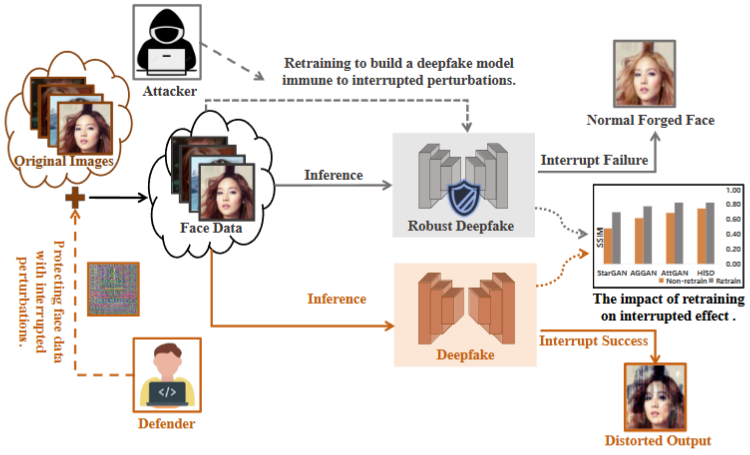
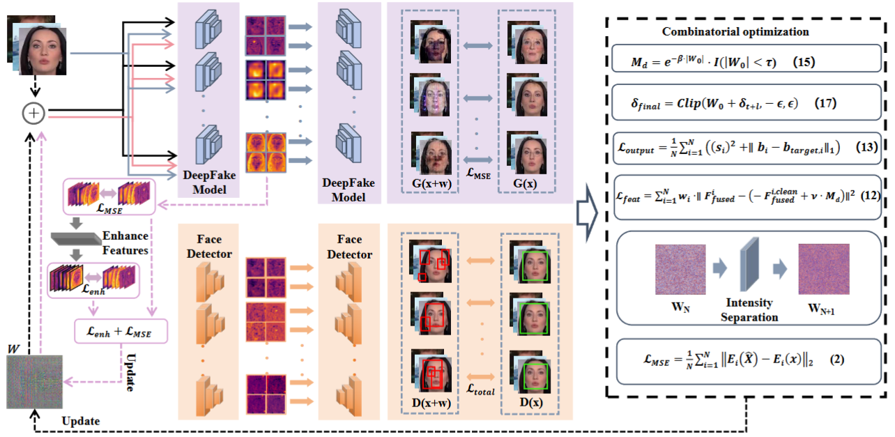
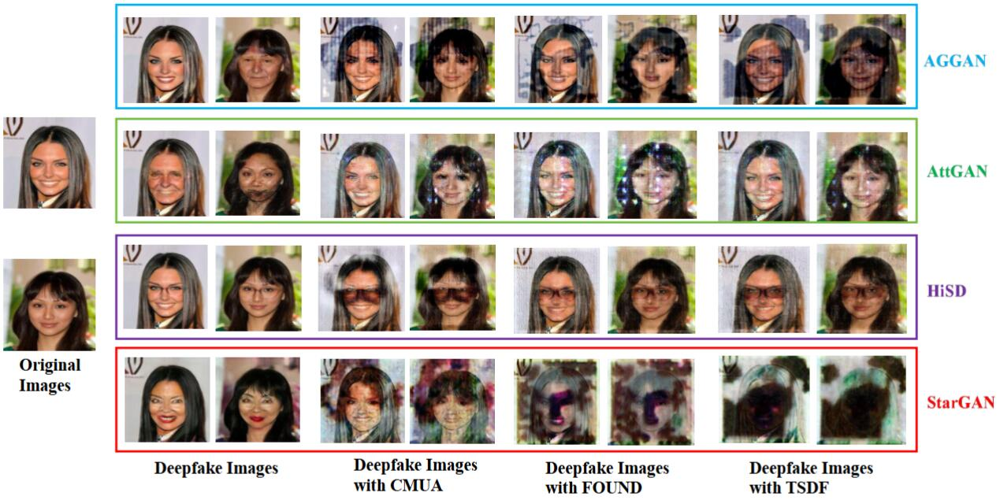
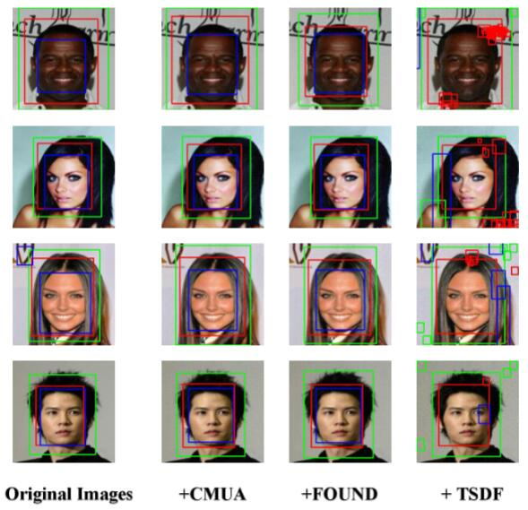

<div align="center">
<h1> Boosting Active Defense Persistence: A Two-Stage Defense Framework Combining Interruption And Poisoning Against Deepfake </h1>
</div>
<div align="center">
<br>
<a href="https://ieeexplore.ieee.org/abstract/document/11436061">-red.svg" alt="Paper"></a>
<!-- <a href="CR_LINK">-green.svg" alt="Camera Ready"></a> -->
</div>

## 🔥 News
* **[2026-03]** Our paper was accepted to the IEEE Transactions on Information Forensics and Security **(TIFS)**!  🎉

## 📆Table of Contents
- [Introduction]
- [Key Features]
- [Overview]
- [Requirements]
- [Installation]
- [Usage]
  - [Dataset Preparation]
  - [Stage 1: Training the Interruption Perturbation]
  - [Stage 2: Training the Poisoning Perturbation]
- [Citation]
- [License]

<br>

## 📖 Introduction
This is the official repository for the TIFS 2026 paper *"[Boosting Active Defense Persistence: A Two-Stage Defense Framework Combining Interruption And Poisoning Against Deepfake](https://ieeexplore.ieee.org/abstract/document/11436061)"*.

<div align="center"> 
   
</div>

> **Fig. 1: Illustration of an interruption-based defense and its failure to retrain.**  The lower path demonstrates an effective interruption process, where protected face data leads to a distorted output from the deepfake model. The upper path illustrates a critical flaw in this interruption-only defense. Attackers can bypass the defense by retraining their model on the protected images. This adaptation makes the model immune to the interruption, ultimately causing the defense to fail.

## ✨ Key Features

* **Two-Stage Active Defense**: Innovatively combines "Immediate Interruption" and "Delayed Poisoning" to provide both real-time and long-term protection.
* **Imperceptible Watermark**: The generated protective perturbation is visually imperceptible, ensuring the usability and aesthetic quality of the original images.
* **Resilience to Adaptive Attacks**: By corrupting the training process with poisoned data, it effectively prevents attackers from using protected images to retrain or fine-tune their generative models.
* **Broad Effectiveness**: The framework's efficacy has been demonstrated through comprehensive evaluations against an ensemble of widely-used generative models, such as StarGAN, AttentionGAN, HiSD, and AttGAN.

## 🧩 Overview

<div align="center"> 
   
</div>

> **Fig. 2: The overall framework of the TSDF method.** 
Our defense framework is composed of two core components: an Interruption Module and a Poisoning Module.
1.  **Interruption Stage**: Applies a subtle perturbation to the original image. This perturbation is sufficient to significantly disrupt the structure and quality of the output when a Deepfake model attempts a face-editing or swapping task.
2.  **Poisoning Stage**: Building upon the interruption perturbation, a poisoning component is added. When an attacker collects these protected images for training their own model, this poisoned data contaminates their training set, leading to severe performance degradation or complete model failure.

```
[Framework Architecture Diagram Will Be Added Here]

 Original Image --> [Interruption Module] --> Protected Image --> [Deepfake Model (Immediate Attack)] --> Degraded Output
                               |
                               +--> [Poisoning Module] --> Poisoned & Protected Image --> [Attacker's Retraining Dataset] --> Failed/Corrupted Model
```

## 🧬 Requirements


* **Python**: 3.6+
* **PyTorch**: 1.9+
* **GPU**: A CUDA-capable GPU is recommended.
* See the `requirements.txt` file for a complete list of dependencies.

## 💻 Installation (Available After Code Release)

1.  **Clone the repository**
    ```bash
    # The repository URL will be provided upon code release
    git clone [https://github.com/vpsg-research/TSDF].
    cd TSDF
    ```
   

2.  **Install dependencies**
    We recommend using a virtual environment (e.g., `conda`) to avoid package conflicts.
    ```bash
    pip install -r requirements.txt
    ```
   

## 🗂️ Usage

### Dataset Preparation

This project uses the CelebA dataset. Please follow the steps below to download and prepare it:

```bash
cd stargan
bash download.sh celeba
```

After downloading, ensure that the `/celeba` directory contains the `img_align_celeba` folder and the `list_attr_celeba.txt` file.

## 🚀 Training
 **Stage 1:** Training the Interruption Perturbation

The goal of this stage is to train the interruption component that can instantly disrupt Deepfake outputs.

* **Configuration**: In the training script or a config file, set `do_poison = False`.
* **Training Steps**: Set the desired number of training steps (e.g., `interruption_steps`).

```bash
# Ensure do_poison is set to False in the configuration
python train.py
```


**Stage 2:** Training the Poisoning Perturbation

After obtaining an optimized interruption perturbation, this stage trains the data poisoning component for persistent defense.

**Configuration**: In the training script or a config file, set `do_poison = True`.
**Training Steps**: Set the desired number of training steps (e.g., `poisoned_steps`).

```bash
# Ensure do_poison is set to True in the configuration
python train.py
```


## 🎨 Visualization Results

<div align="center">  </div>

> **Fig. 3: Visual comparison of the interruption effect.**
---

<div align="center">  </div>

> **Fig. 4: Face detection results before and after being perturbed.**
---

## ✒️ Citation

If you find this repository helpful, please cite our paper:
```bibtex
@article{zheng2026boosting,
  title={Boosting Active Defense Persistence: A Two-Stage Defense Framework Combining Interruption and Poisoning Against Deepfake},
  author={Zheng, Hongrui and Li, Yuezun and Wang, Liejun and Diao, Yunfeng and Guo, Zhiqing},
  journal={IEEE Transactions on Information Forensics and Security},
  year={2026},
  publisher={IEEE}
}
```


## 📜License

This project is licensed under the [Apache 2.0 License](https://github.com/vpsg-research/TSDF/main/LICENSE).


---
